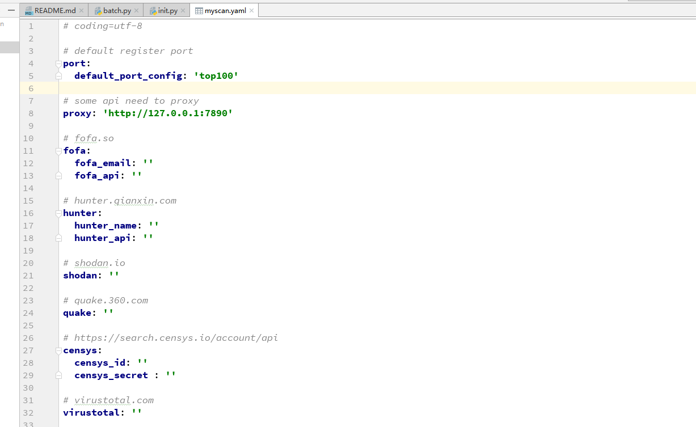
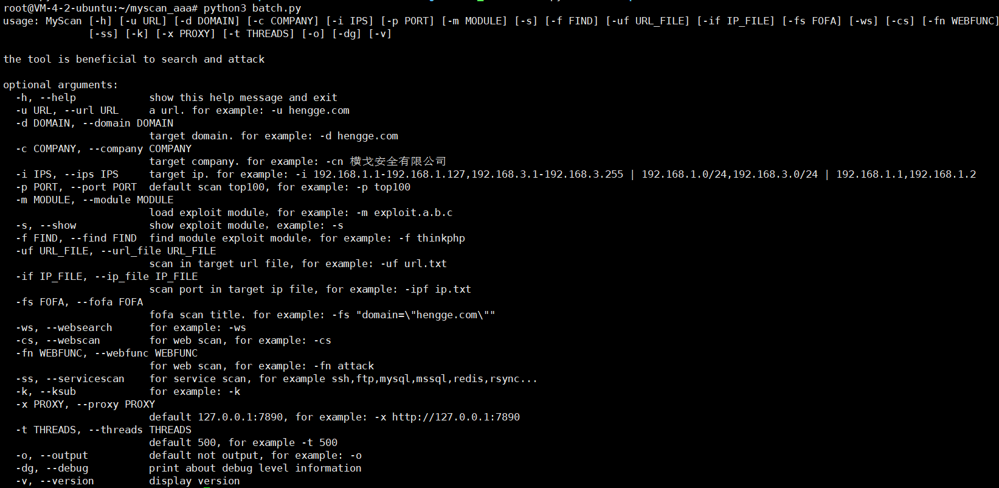

# myscan

[](https://www.python.org/) 

图形化实现地址：https://github.com/chibd2000/vue-myscan

Team：HengGe横戈安全团队

Author：chibd2000

myscan是异步实现信息搜集以及漏洞利用功能的一款自动化扫描器

## 配置

环境：python3.8 + ubuntu16，其他Linux的环境和python版本未测试过

1、安装依赖包

`pip3 install -r requirements.txt`

2、配置文件

`conf/myscan.yaml`

提示：效果最佳最好挂上代理，代理设置地址为 conf/myscan.yaml 中的 proxy 字段，默认代理端口为 http://127.0.0.1:7890



3、设置最大文件描述符限制

在 Linux 平台，可以使用 ulimit 命令来修改最大文件描述符限制：

查看当前会话最大文件描述符限制（默认1024）：ulimit -n

临时修改限制，只对当前的会话有效：ulimit -SHn 65536

永久修改限制，在 /etc/security/limits.conf 文件里新增以下内容：

```
* hard nofile 65536
* soft nofile 65536
```

## 使用

### 默认使用

`python3 batch.py -d zjhu.edu.cn -k -ws -cs -ss -o`

### 自定义功能使用

-k 配合ksubdomain进行搜集 -ws信息搜集 -cs 搜集完的域名进行扫描POC  -ss 搜集完的端口服务进行扫描POC -o是输出

-fs 支持单独fofa关键词进行搜集 -m 指定模块进行测试 一般用来写完POC来进行测试正确性，当然其他的用途都是可以的

-i 指定ip，可以单个也可以多个（逗号分隔即可），支持CIDR格式扫描，如果-i 没有指定 -p的话，那么默认就是扫描top100的端口

-p 指定ip扫描的端口，可以单个也可以多个（逗号分隔即可），也支持范围（比如1-70，则是1-70个端口）

-cs 如果不带 -m 的话，那么默认扫描的就是所有的POC，指定带上了 -m 的话则指定POC

-fn 指定POC中的detect函数或者exec函数，直接单独只进行detect或者exec， -fn detect 或者 -fn exec

-s 展示所有已有的POC模块

-f 搜索对应关键字的POC模块

还有一些参数没有说到，如果大家觉得可以的话还可以看下 -h ，看看命令行参数的提示

```
# python3 batch.py -d test.com -k -ws
# python3 batch.py -d test.com -k -ws -cs
# python3 batch.py -d test.com -k -ws -cs -ss
# python3 batch.py -d test.com -k -ws -cs -ss -o
```

```
# python3 batch.py -fs "title=\"系统管理\"" -cs
# python3 batch.py -fs "title=\"系统管理\"" -m exploit.a.b -cs
# python3 batch.py -fs "title=\"系统管理\"" -m exploit.a.b,exploit.c.d -cs
```

```
# python3 batch.py -u test.com -cs
# python3 batch.py -u test.com -m exploit.a.b -cs
# python3 batch.py -u test.com -m exploit.a.b, exploit.c.d -cs
```

```
# python3 batch.py -i 127.0.0.1
# python3 batch.py -i 127.0.0.1 -p 9001 
# python3 batch.py -i 127.0.0.1 -p 9001,9002,9003
# python3 batch.py -i 127.0.0.1 -p 9001-9005
```

```
# python3 batch.py -i 127.0.0.1 -cs
# python3 batch.py -i 127.0.0.1 -m exploit.a.b -cs
# python3 batch.py -i 127.0.0.1 -m exploit.a.b,exploit.c.d -cs
# python3 batch.py -i 127.0.0.1 -m exploit.a.b -cs -ss
# python3 batch.py -i 127.0.0.1 -m exploit.a.b,exploit.c.d -cs -ss
```

```
# python3 batch.py -i 127.0.0.1 -p 9001 -m exploit.a.b -cs
# python3 batch.py -i 127.0.0.1 -p 9001 -m exploit.a.b,exploit.c.d -cs
# python3 batch.py -i 127.0.0.1 -p 9001 -m exploit.a.b -cs -ss
# python3 batch.py -i 127.0.0.1 -p 9001 -m exploit.a.b,exploit.c.d -cs -ss
```

```
# python3 batch.py -i 127.0.0.1 -p 9001,9002,9003 -m exploit.a.b -cs
# python3 batch.py -i 127.0.0.1 -p 9001,9002,9003 -m exploit.a.b,exploit.c.d -cs
# python3 batch.py -i 127.0.0.1 -p 9001,9002,9003 -m exploit.a.b -cs -ss
# python3 batch.py -i 127.0.0.1 -p 9001,9002,9003 -m exploit.a.b,exploit.c.d -cs -ss
```

```
# python3 batch.py -i 127.0.0.1 -p 9001-9005 -m exploit.a.b -cs
# python3 batch.py -i 127.0.0.1 -p 9001-9005 -m exploit.a.b,exploit.c.d -cs
# python3 batch.py -i 127.0.0.1 -p 9001-9005 -m exploit.a.b -cs -ss
# python3 batch.py -i 127.0.0.1 -p 9001-9005 -m exploit.a.b,exploit.c.d -cs -ss
```

```
# python3 batch.py -uf url.txt -cs
# python3 batch.py -uf url.txt -m exploit.a.b -cs
# python3 batch.py -uf url.txt -m exploit.a.b,exploit.c.d -cs
```

```
# python3 batch.py -if ip.txt -cs
# python3 batch.py -if ip.txt -m exploit.a.b -cs
# python3 batch.py -if ip.txt -m exploit.a.b,exploit.c.d -cs
# python3 batch.py -if ip.txt -cs -ss
# python3 batch.py -if ip.txt -m exploit.a.b -cs -ss
# python3 batch.py -if ip.txt -m exploit.a.b,exploit.c.d -cs -ss
```



### POC编写格式

提示：`self.priority = 1`，这个字段比较重要，如果当前目录下A,B,C有多个模块的话，那么如果扫描的时候想用B模块扫描，为了减少扫描量和准确性那么只需要在B模板中加上`self.priority = 1`字段即可，否则A,B,C三个模块都会被加载

```
# coding=utf-8
# @Author   : zpchcbd HG team
# @Blog     : https://www.cnblogs.com/zpchcbd/
# @Time     : 2021-09-08 16:30
# @warn: <<<<don't delete me>>>> <<<<don't delete me>>>> <<<<don't delete me>>>> <<<<don't delete me>>>> <<<<don't delete me>>>>
# @warn: <<<<don't delete me>>>> <<<<don't delete me>>>> <<<<don't delete me>>>> <<<<don't delete me>>>> <<<<don't delete me>>>>
# @warn: <<<<don't delete me>>>> <<<<don't delete me>>>> <<<<don't delete me>>>> <<<<don't delete me>>>> <<<<don't delete me>>>>
# @warn: <<<<don't delete me>>>> <<<<don't delete me>>>> <<<<don't delete me>>>> <<<<don't delete me>>>> <<<<don't delete me>>>>
# @warn: <<<<don't delete me>>>> <<<<don't delete me>>>> <<<<don't delete me>>>> <<<<don't delete me>>>> <<<<don't delete me>>>>
# @warn: <<<<don't delete me>>>> <<<<don't delete me>>>> <<<<don't delete me>>>> <<<<don't delete me>>>> <<<<don't delete me>>>>
# @warn: <<<<don't delete me>>>> <<<<don't delete me>>>> <<<<don't delete me>>>> <<<<don't delete me>>>> <<<<don't delete me>>>>
# @warn: <<<<don't delete me>>>> <<<<don't delete me>>>> <<<<don't delete me>>>> <<<<don't delete me>>>> <<<<don't delete me>>>>
# @warn: <<<<don't delete me>>>> <<<<don't delete me>>>> <<<<don't delete me>>>> <<<<don't delete me>>>> <<<<don't delete me>>>>
# @warn: <<<<don't delete me>>>> <<<<don't delete me>>>> <<<<don't delete me>>>> <<<<don't delete me>>>> <<<<don't delete me>>>>
# @warn: <<<<don't delete me>>>> <<<<don't delete me>>>> <<<<don't delete me>>>> <<<<don't delete me>>>> <<<<don't delete me>>>>
# @warn: <<<<don't delete me>>>> <<<<don't delete me>>>> <<<<don't delete me>>>> <<<<don't delete me>>>> <<<<don't delete me>>>>

from exploit.scripts import BaseScript
from core.data import gLogger
from core.myenums import BugLevel, BugType
from core.request.asynchttp import *


class Script(BaseScript):
    name = 'XXXX'

    def __init__(self, target):
        super().__init__()
        # target
        self.target = target
        # level
        self.bug_level = BugLevel.HIGH
        # 类型
        self.bug_type = BugType.RCE
        # 编号
        self.bug_number = 'bugNumber'
        # 来源
        self.bug_refer = 'refer'
        # 特定路径判断
        self.detect_path_list = ['/detectPath']
        # exec
        self.exec_path_list = ['/execPath']
        # priority
        self.priority = 1
        # 相关信息
        self.info = 'information about the bug info'

    async def detect(self):
        async with aiohttp.ClientSession() as session:
            for detect_path in self.detect_path_list:
                url = f'http://{self.target}{detect_path}' if self.target.startswith(('http:', 'https:')) is False else f'{self.target}{detect_path}'
                text = await AsyncFetcher.fetch(session=session, url=url, headers=self.headers, timeout=self.req_timeout)
                if 'something about keywords in the scripts' in text:
                    self.flag = True
                    gLogger.myscan_info('[{} {}] {}'.format(self.name, BugType.FINGER, url))
                    return {'name': '{} {}'.format(self.name, BugType.FINGER), 'url': url, 'software': self.name}

    async def exec(self):
        async with aiohttp.ClientSession() as session:
            for exec_path in self.exec_path_list:
                url = f'http://{self.target}{exec_path}' if self.target.startswith(('http:', 'https:')) is False else f'{self.target}{exec_path}'
                text = await AsyncFetcher.fetch(session=session, url=url, headers=self.headers, timeout=self.req_timeout)
                if 'something about keywords in the scripts' in text:
                    gLogger.myscan_info('[{} {}] {}'.format(self.name, self.bug_type, url))
                    return {'name': '{} {}'.format(self.name, self.bug_type), 'url': url, 'software': self.name}

```


