# myscan

[](https://www.python.org/)  

横戈安全团队  
横戈安全团队  
横戈安全团队  

author: Chibd2000
blog: https://www.cnblogs.com/zpchcbd/

# 安装

`pip3 install -r requirements.txt`

配置API：spider/common/config.py

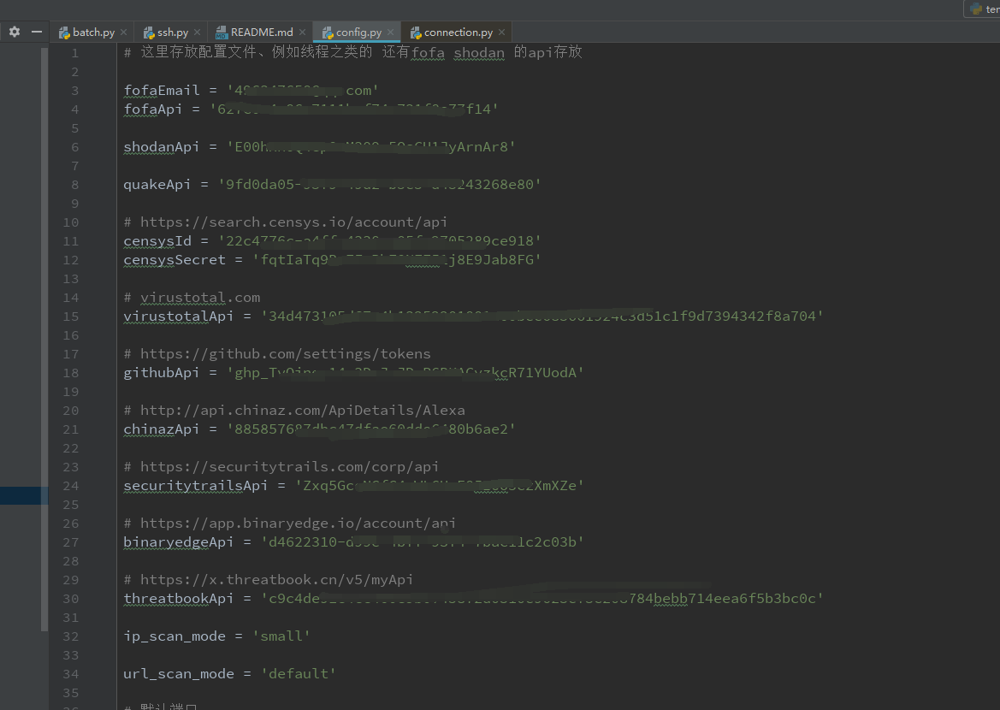

运行环境：linux centos7 + py3.8

这里自己再说下为什么要在linux上面跑，python的asyncio是基于selectors事件循环的windows上的文件描述符限制量为512实在是太少了，所以要跑的话都放在linux上面（默认为1024），并且跑的时候最好改下文件描述符

在 Linux 平台，可以使用 ulimit 命令来修改最大文件描述符限制：

查看当前会话最大文件描述符限制（默认1024）：ulimit -n

临时修改限制，只对当前的会话有效：ulimit -SHn 65536

永久修改限制，在 /etc/security/limits.conf 文件里新增以下内容：

```
* hard nofile 65536
* soft nofile 65536
```

说明：这个脚本纯属自用，只是开源到github上，要用的话一般的用法下面中都有讲到

# 构建信息搜集/漏洞扫描

## 信息搜集

- 1-DNS枚举查询(ksubdomain)子域名 (默认没开起来，要开的话自己在代码里面改下，batch.py 418行)

- 2-百度/Bing关键词查询子域名

- 3-fofa/shodan/quake/hunter整合查询子域名

每个空间引擎搜集到的资产都会有点不一样，所以就是整合多个来进行合并，提高覆盖率，到时候好方便观察。

默认都会存储空间引擎查询到的所有端口（防止后面的端口扫描有可能没扫到，添加容错率），
然后和之后的端口扫描出来的结果一起整合，最后在服务扫描模块中一起进行探测利用。

默认语法关键字查询如下

1) domain="test.com"

2) host="test.com"

3) cert="test.com"

4) icon_hash="-1227431955"
 
- 4-ctfr证书查询子域名

- 5-第三方接口查询子域名

这里面的一些error是正常的，我这里没有隐藏掉，然后一些接口有cloudflare验证，比如bufferover接口，自己的方法是通过获取一批代理IP然后批量
访问它，从而实现绕过cloudflare的验证

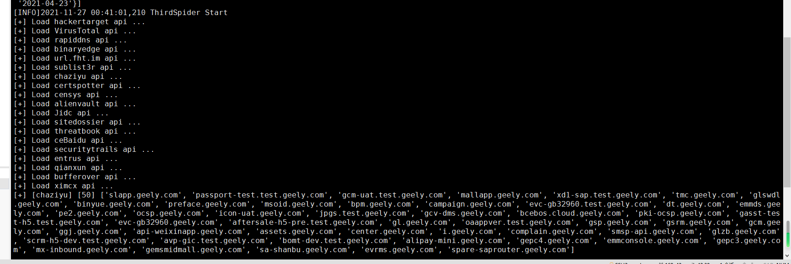

- 6-github查询子域名

- 7-子域名查询IP

方便用于后面的信息搜集，HOSTS碰撞之类的就需要用到相关的内网地址所对应的域名信息

- 8-IP反查子域名

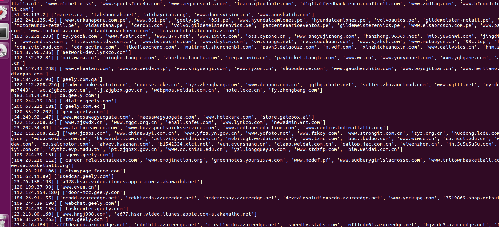

- 9-nmap指纹库socket异步探测开放端口服务，top100高危端口，并发量200，一个C段扫描时间为3分钟

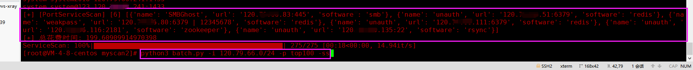

- 10-子域名友链查询子域名


- 11-添加域名整理字符串相似匹配度

在资产挖掘中，有基于服务预测域名(landgrey作者写的域名预测工具) 还有域名枚举(seay作者写的layer工具)的，我觉得通过域名匹配，然后再其中发现
规律也是一种方法，然后这里就用difflib库来进行探测匹配，来匹配下相似度，然后之后就可以用相关脚本在有规律性的点中进行fuzz，而且自己挖src的
时候这种方法也能探测出很多的资产来，所以自己可能觉得也是一种方法

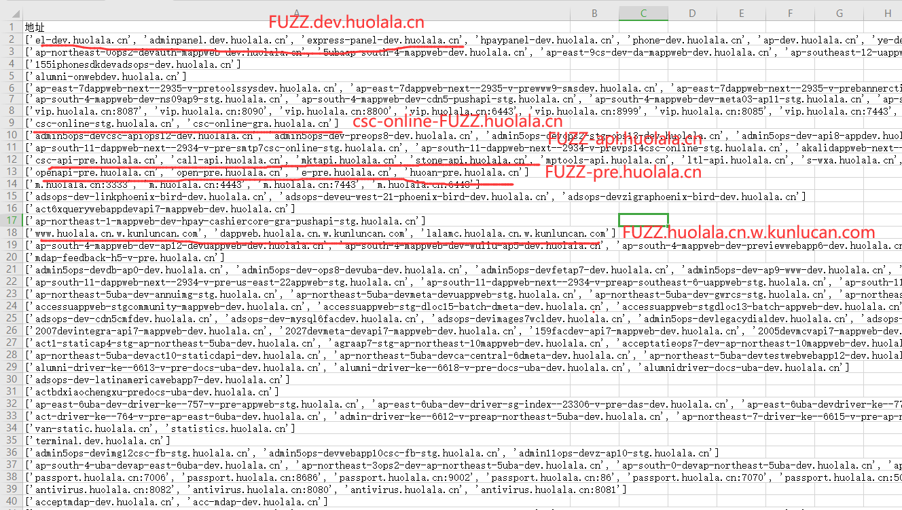

- 12-爱企查查询(对外投资，控股公司，分支架构，备案)

这个默认没有在 -d 参数中进行跑，需要手动运行如下命令:

`python3 batch.py -d result.com -cn 横戈信息安全有限公司`


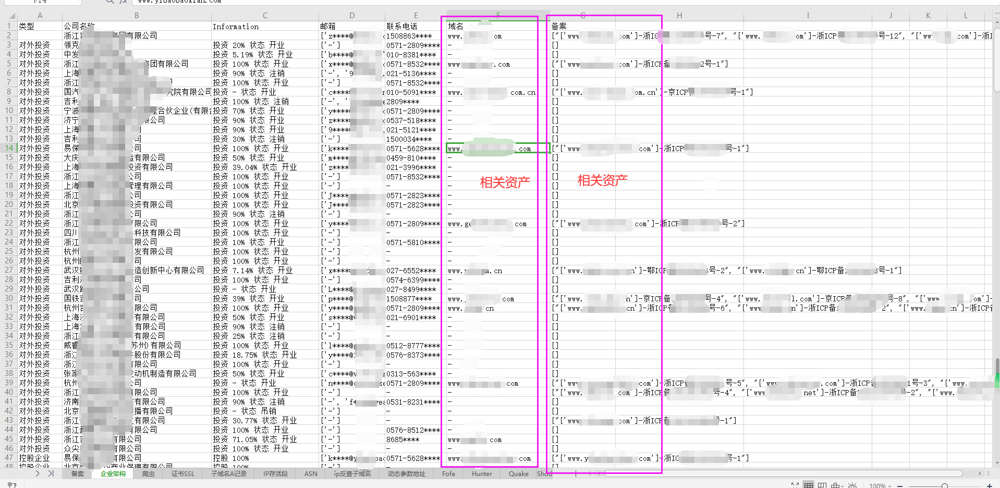

中间环节

- 12、探测存活，整理数据，如下格式所示  
```
# 资产IP+端口格式

[+] [ipPortList] [280] [{'ip': '202.103.147.144', 'port': [8080, 8090]}, {'ip': '125.19.57.134', 'port': []}, {'ip': '58.60.230.103', 'port': [8000, 2000]}, {'ip': '202.103.147.169', 'port': [25]}]

# 端口服务扫描格式

[+] [ipPortServiceList] [20] [{'service': 'http', 'ip': ['47.110.217.169:8080', '47.113.23.213:8080', '58.251.27.73:8080', '113.98.59.166:8080', '63.221.140.244:8080', '47.254.137.137:8080', '58.251.27.73:9000']}, {'service': 'bgp', 'ip': ['58.60.230.102:179']}, {'service': 'https-alt', 'ip': ['47.110.217.169:8443', '47.96.196.50:8443']}, {'service': 'osiris', 'ip': ['103.27.119.242:541']}, {'service': 'cisco-sccp', 'ip': ['58.60.230.103:2000']}, {'service': 'redis', 'ip': ['127.0.0.1:6377']}, {'service': 'smtp', 'ip': ['202.103.147.169:25', '202.103.147.161:25', '63.217.80.70:25', '202.103.147.172:25']}, {'service': 'ssl/http', 'ip': ['47.52.122.123:8443']}, {'service': 'http-proxy', 'ip': ['222.134.66.173:8080', '222.134.66.177:8080']}]

# 存储可注入探测参数列表(相似度对比)
    
[+] [gParamsList] [24] ['http://supporthk.zjhu.xxx.cn/support/news/NewsMain.aspx?type=CenterProfile', 'http://mobdl.support.xxx.edu.cn/support/EReadFiles/AppReleaseDownload/chapter_en.htm?v=5']

# 存储js文件中的js敏感接口

[+] gJavaScriptParamList = []

# 存储资产IP区段分布以及资产IP在指定的区段出现的次数

[+] [gIpSegmentList] [228] [{'ipSegment': '183.232.187.0/24', 'ip': ['183.232.187.210', '183.232.187.201', '183.232.187.197'], 'num': 3}, {'ipSegment': '218.2.178.0/24', 'ip': ['218.2.178.29', '218.2.178.22', '218.2.178.23', '218.2.178.21', '218.2.178.15', '218.2.178.14', '218.2.178.27', '218.2.178.32'], 'num': 8}]

# ASN记录

[+] [gAsnList] [28] [9498, 11419, 3356, 14618, 45090, 3491, 4134, 58541, 45102, 58543, 15169, 58952, 36937, 9929, 37963, 4812, 4808, 17621, 17623, 23650, 4837, 56040, 132203, 1267, 7160, 16509]

# 显示/隐形资产IP
 
[+] [gIpList] [343] ['183.232.187.210', '218.2.178.29', '103.27.119.242', '59.83.221.138', '111.3.79.208', '61.132.54.18', '58.60.230.102', '47.92.49.128', '58.60.230.42']

# 显示/隐形资产域名

[+] [domainList] [522] ['b2bprodhk.xxx.com.cn', 'out2.xxx.com.cn', 'topicscn.xxx.com.cn', '18.184.132.222:443', 'ilearning.xxx.com.cn', '47.75.103.207:443', 'sslsfshct.xxx.com.cn', 'pantheon-akamaigs1.wpc.edgecastcdn.net.xxx.com.cn', 'support.xxx.com.cn', 'mx10.xxx.com.cn', 'ca.xxx.com.cn', '47.92.49.128', 'guide.xxx.com', 'mx5.xxx.com.cn', '39.98.88.177:443', 'xxxtcm.xxx.com.cn', '47.111.170.47', 'apimes.sc.xxx.com.cn']
```

## 漏洞扫描

### CMS框架漏洞

- 集成了大概100+个poc

利用的时候，可以先通过列举相关的poc，然后指定poc来进行测试

`python3 batch.py -m exploit`


- 单域名探测单/多个poc

`python3 batch.py -u 172-18-0-44-8080.AAA.BBB.cn -m exploit.web.Apache.Shiro.550 -cs`


`python3 batch.py -u 172-18-0-44-8080.AAA.BBB.cn -m exploit.web.Apache.Shiro.550,exploit.web.Apache.Sentry.unauth_ssrf -cs`


- 配合fofa批量探测

单个poc:`python batch.py -fs app=\"XXXXX\" -m exploit.web.Meeting.v2Conference.sql_inject -cs`

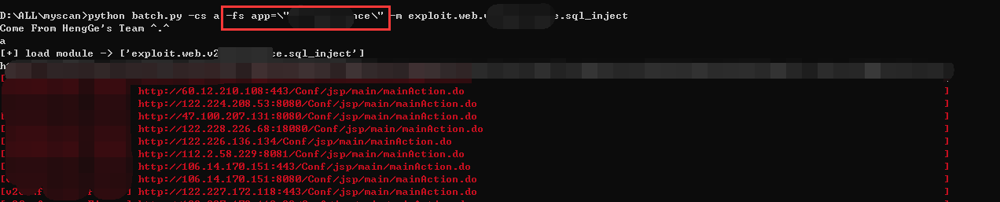

默认所有poc:`python batch.py -fs app=\"XXXXX\" -cs`

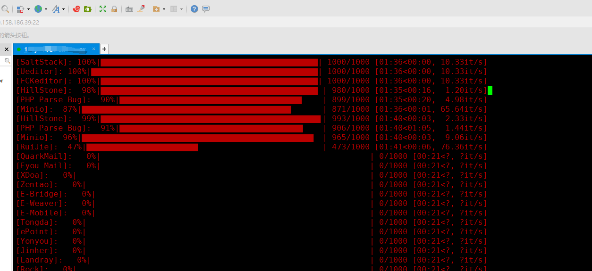

### 端口服务漏洞

用于探测一些中间件的未授权和敏感端口的弱口令以及部分可能存在的反序列化端口，比如RMI log4j Dubbo之类的

一个C段端口扫描默认TOP100 + 服务漏洞扫描 总共3分钟，因为是快速漏洞利用的脚本，个人推荐就是扫描TOP100就足够了
脚本里面并发量可以自定义。如果真的想要准确的扫描端口，建议还是挂着masscan+nmap配合进行扫描

- 支持单网段 + 服务漏洞扫描

`python3 batch.py -i 120.XX.XX.0/24 -p top100 -ss`


- 支持单ip + 服务漏洞扫描

`python3 batch.py -i 120.79.66.XX -p top100 -ss`

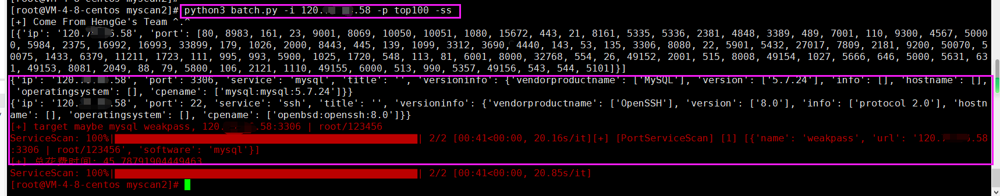

- 支持多网段/多IP + 服务漏洞扫描

`python3 batch.py -i 120.79.XX.0/24,120.79.XX.0/24 -p top100 -ss`

`python3 batch.py -i 1.1.1.1, 2.2.2.2 -p top100 -ss`

### SQL注入漏洞

- 通过sqlmap来进行探测，根据sqlmap来判断是否存在注入，用的方法是langzi的方法，参考文章在下面

# 用法：

记得挂代理，因为部分接口都需要翻墙，代理端口为7890，目前是写死的，之后完全写完之后再改这个代理端口的问题。

脚本运行: `python3 batch.py -d zjhu.edu.cn`

信息搜集测试域名：zjhu.edu.cn

结果相关域名资产大概255，里面会包括部分隐藏资产IP之类的，该域名搜集时间加上数据清洗和整理，总共花费7分钟。


#设计的思维导图

个人感觉整体架构写的其实不是很好，可能是在写的过程中，想法同样也会发生变化，当后面觉得前面不完善的时候，又需要强行插入一些东西，看起来就十分的僵硬，还是有很多需要学习的地方。
    
#总结：

1、学习python编写代码

2、感谢ske大师兄和其他人的项目，前人栽树，后人乘凉

3、虽然说是造轮子，但是自己觉得对于自己来说还是有收获的

#参考的项目和文章：

1、https://xz.aliyun.com/t/9508

2、https://www.t00ls.net/viewthread.php?tid=62399

3、https://github.com/0x727/ShuiZe_0x727/

4、https://github.com/shmilylty/OneForAll

5、https://github.com/laramies/theHarvester

6、https://github.com/knownsec/ksubdomain

7、https://mp.weixin.qq.com/mp/appmsgalbum?__biz=MzI0NzEwOTM0MA==&action=getalbum&album_id=1368680445315235841

8、http://www.langzi.fun/Sqlmap%E9%80%9F%E6%9F%A5%E8%A1%A8%E4%B8%8EPython%E8%BF%9B%E8%A1%8C%E5%8A%9F%E8%83%BD%E7%A7%BB%E6%A4%8D.html

9、http://mp.weixin.qq.com/s?__biz=Mzg4MzY3MTgyMw==&mid=2247483720&idx=1&sn=5449ed47b74cf892c01eb8833b59c952&chksm=cf429728f8351e3eee7387ca85c79a705ae68122509484d49bc278e24c9de4e22ef0080dc0c8&mpshare=1&scene=23&srcid=1114LGKgJqRAT9xqFA9s2BwC&sharer_sharetime=1636911890316&sharer_shareid=1b35adb1b046ef1a6379932d3eabbaf8#rd

10、https://github.com/sqlmapproject/sqlmap

#需要增加的

~~1、基于请求数据的时候实现进度可视化，比如进度条~~（已实现）

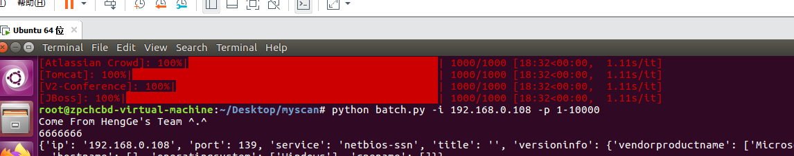

~~2、基于fofa指定关键词 -> 利用POC探测，有时候新写的POC需要待验证，这时候都可以用到FOFA之类的来进行采取测试~~（已实现）

3、基于C段 -> 利用探测，指定IP段多资产存活需要进行单独探测

~~4、portSpider portWrapper类还没实现~~（已实现）


~~5、github域名爬取还没实现~~（已实现）

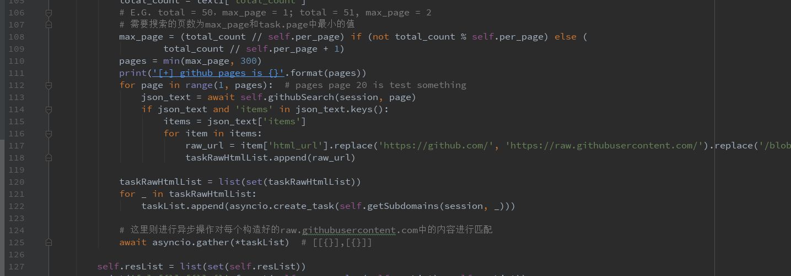

~~6、微信小程序爬取还没实现~~（已实现）


~~7、企业公司相关爬取还没实现（通过爱企查）~~（已实现）

8、探测存活的时候没有爬取相关JS敏感接口信息 参考jsfinder 接口参数爬取和子域名搜集

~~9、exploit web利用模块补充~~（已实现）

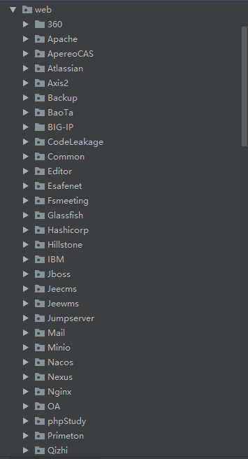

~~10、单域名 漏洞指定模块探测~~（已实现）

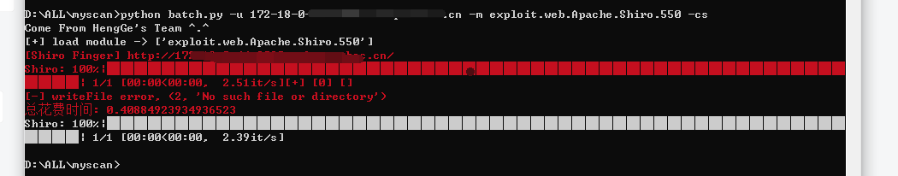

11、HOST碰撞

自己在挖掘src的时候碰到过很多，也同样撞出过挺多的资产，考虑要不要写进去，自己用HOST碰撞的时候都是用ffuf感觉这个速度很快，并且很准确，这个用
的就挺好的...

~~12、优化CMS扫描（对于同类型多EXP的探测进行优化，加快总扫描速度）~~ （已完成）

这里要优化的是什么？

那么漏洞利用的时候就会分成两种情况

1) 一个系统对应的漏洞只有一个EXP

2) 一个系统对应的漏洞有多个EXP

因为自己写的一个Script类（利用模块类）它每次在进行漏洞利用之前都会先探测下目标是不是为指定的系统框架，是的话才会进行payload利用。

所以这两种情况在当前的漏洞利用的过程中，如果是类型为“一个系统对应的漏洞有多个EXP”的时候，它在利用之前每次都会对对方先进行探测，
而此时为“一个系统对应的漏洞有多个EXP”，那么就会造成每次漏洞利用之前先进行探测的请求的数量就会多上(同种漏洞模块的数量-1)*当前所有要检测的域名数量，
明明只需要第一次进行探测的时候知道了是这个系统，那么后面的同类型利用模块它每次就会跳过CMS识别，直接进行漏洞利用，这里优化的就是这个情况。

FOFA上搜索的1000条域名数据测试，没优化之前的总EXP扫描速度为48分钟，目前为40分钟，写的还是不好，之后慢慢改好了，之后随着时间慢慢往上面改。

2021.11.27 16.51 1000条域名 110个poc 探测时间为32分钟

~~13、一些BUG~~（已完成）

~~第一个问题: writeFile 有时候会出现的异常~~
```
  File "/root/myscan/spider/BingSpider.py", line 24, in writeFile
    workbook = openpyxl.load_workbook(abs_path + str(self.domain) + ".xlsx")
  File "/usr/local/python3/lib/python3.8/site-packages/openpyxl/reader/excel.py", line 245, in load_workbook
    ws_parser.parse()
  File "/usr/local/python3/lib/python3.8/site-packages/openpyxl/reader/worksheet.py", line 124, in parse
    for _, element in it:
  File "/usr/local/python3/lib/python3.8/xml/etree/ElementTree.py", line 1229, in iterator
    data = source.read(16 * 1024)
  File "/usr/local/python3/lib/python3.8/zipfile.py", line 939, in read
    data = self._read1(n)
  File "/usr/local/python3/lib/python3.8/zipfile.py", line 1007, in _read1
    data += self._read2(n - len(data))
  File "/usr/local/python3/lib/python3.8/zipfile.py", line 1042, in _read2
    raise EOFError
EOFError
```

~~第二个异常: 需要代理接口的请求 需要捕获异常~~

`aiohttp.client_exceptions.ClientProxyConnectionError`


~~14、springboot的actuator探测脚本存在误报性 （之前src有个站点误报）~~（已完成）

~~15、指纹EXP如下补充~~（已完成）

~~- 添加信呼OA指纹~~ 参考文章：https://www.t00ls.cc/viewthread.php?tid=63279  

~~- 添加Panabit指纹~~

~~- 添加小鱼易连视频会议系统~~  

~~- 添加会捷通云视讯指纹~~

~~- 添加SonarQube指纹~~

~~13、github项目 Common 和 Exploit 和 Spider 都可以去掉~~（已完成）

16、SQL注入自动化探测（正在写）

- sql相似度匹配 参考文章：http://mp.weixin.qq.com/s?__biz=Mzg4MzY3MTgyMw==&mid=2247483720&idx=1&sn=5449ed47b74cf892c01eb8833b59c952&chksm=cf429728f8351e3eee7387ca85c79a705ae68122509484d49bc278e24c9de4e22ef0080dc0c8&mpshare=1&scene=23&srcid=1114LGKgJqRAT9xqFA9s2BwC&sharer_sharetime=1636911890316&sharer_shareid=1b35adb1b046ef1a6379932d3eabbaf8#rd

- 脚本链接通过sqlmap探测 参考文章：http://www.langzi.fun/Sqlmap%E9%80%9F%E6%9F%A5%E8%A1%A8%E4%B8%8EPython%E8%BF%9B%E8%A1%8C%E5%8A%9F%E8%83%BD%E7%A7%BB%E6%A4%8D.html

~~17、aiossh爆破的提示关闭，优化命令行窗口~~（已完成）

~~18、发现servicescan进度条的bug，有时候会发现进度条没有慢就已经结束了~~（已完成）

~~19、Alivespider模块代码改良下，其中的每个功能点可以单独定义类外函数 然后在Alivespider中进行调用~~（已完成）

20、添加代理请求的命令行参数

21、log4j指纹添加到端口banner中

~~22、将相关的爬取的脚本参数进行存储excel（之前都没进行存储）~~（已完成）

~~23、添加域名整理字符串相似匹配度，方便FUZZ~~（已完成）

在资产挖掘中，有基于服务预测域名(landgrey作者有写过一个域名预测) 还有域名枚举的，我觉得通过域名匹配，然后再其中发现规律也是一种方法，然后
这里就用difflib库来进行探测匹配，来匹配下相似度，然后之后就可以用相关脚本在有规律性的点中进行fuzz，而且挖src的时候这种方法也能探测出很多
的资产来，所以自己觉得也是一种方法


~~24、接口添加~~（已完成）

~~- 添加censys接口~~

~~- 添加hunter奇安信接口~~

~~25、filterCDN方法添加(为后面的portscan节省时间，如果的cdn网段的ip进行端口扫描的话是无意义的)~~（已完成）

~~26、flushIpSegment方法修改（原本清洗数据时间太长，这个方法改了可以缩短清洗数据的时间）~~（已完成）

~~27、信息搜集完的数据防止遗失，都会通过logger类来进行保存在log目录下进行保存~~（已完成）
