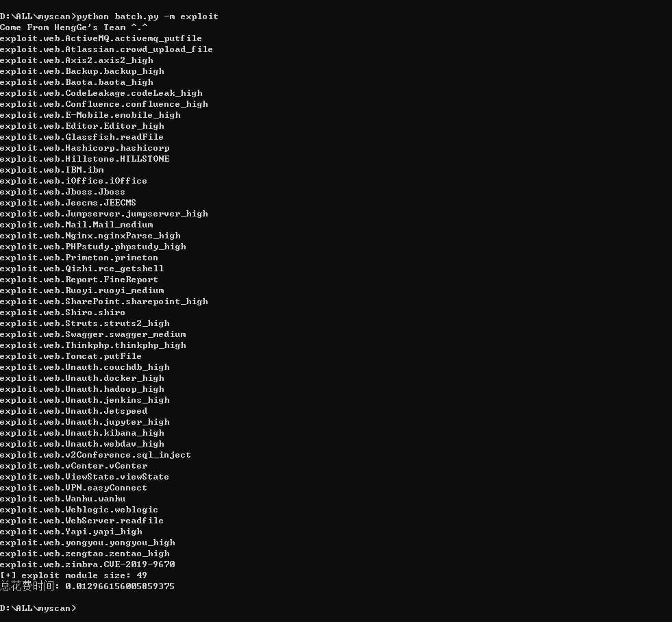

# myscan

没写完，等九月份去学校了有时间慢慢把要写的都写上...

构建信息搜集/漏洞扫描

已经实现的功能：

信息搜集（多线程+异步IO）：

- 1-DNS枚举查询(ksubdomain)子域名 

- 2-百度/Bing关键词查询子域名

- 3-FOFA/SHODAN/QUAKE查询子域名

- 4-ctfr证书查询子域名

- 5-第三方接口查询子域名

- 6-github查询子域名

- 7-子域名查询IP

- 8-IP反查子域名

- 9-nmap指纹库socket异步探测开放端口服务

- 10-子域名友链查询子域名

- 11-爱企查股权结构查询

- 12-微信公众号查询

中间环节

- 12、探测存活，整理数据，如下格式所示  
```
# 资产IP+端口格式

[+] [ipPortList] [280] [{'ip': '202.103.147.144', 'port': [8080, 8090]}, {'ip': '125.19.57.134', 'port': []}, {'ip': '58.60.230.103', 'port': [8000, 2000]}, {'ip': '202.103.147.169', 'port': [25]}]

# 端口服务扫描格式

[+] [ipPortServiceList] [20] [{'service': 'http', 'ip': ['47.110.217.169:8080', '47.113.23.213:8080', '58.251.27.73:8080', '113.98.59.166:8080', '63.221.140.244:8080', '47.254.137.137:8080', '58.251.27.73:9000']}, {'service': 'bgp', 'ip': ['58.60.230.102:179']}, {'service': 'https-alt', 'ip': ['47.110.217.169:8443', '47.96.196.50:8443']}, {'service': 'osiris', 'ip': ['103.27.119.242:541']}, {'service': 'cisco-sccp', 'ip': ['58.60.230.103:2000']}, {'service': 'redis', 'ip': ['127.0.0.1:6377']}, {'service': 'smtp', 'ip': ['202.103.147.169:25', '202.103.147.161:25', '63.217.80.70:25', '202.103.147.172:25']}, {'service': 'ssl/http', 'ip': ['47.52.122.123:8443']}, {'service': 'http-proxy', 'ip': ['222.134.66.173:8080', '222.134.66.177:8080']}]

# 存储可注入探测参数列表(相似度对比)

[+] [gParamsList] [24] ['http://supporthk.zjhu.xxx.cn/support/news/NewsMain.aspx?type=CenterProfile', 'http://mobdl.support.xxx.edu.cn/support/EReadFiles/AppReleaseDownload/chapter_en.htm?v=5']

# 存储js文件中的js敏感接口

gJavaScriptParamList = []

# 存储资产IP区段分布以及资产IP在指定的区段出现的次数

[+] [gIpSegmentList] [228] [{'ipSegment': '183.232.187.0/24', 'ip': ['183.232.187.210', '183.232.187.201', '183.232.187.197'], 'num': 3}, {'ipSegment': '218.2.178.0/24', 'ip': ['218.2.178.29', '218.2.178.22', '218.2.178.23', '218.2.178.21', '218.2.178.15', '218.2.178.14', '218.2.178.27', '218.2.178.32'], 'num': 8}]

# ASN记录

[gAsnList] [28] [9498, 11419, 3356, 14618, 45090, 3491, 4134, 58541, 45102, 58543, 15169, 58952, 36937, 9929, 37963, 4812, 4808, 17621, 17623, 23650, 4837, 56040, 132203, 1267, 7160, 16509]

# 显示/隐形资产IP
 
[gIpList] [343] ['183.232.187.210', '218.2.178.29', '103.27.119.242', '59.83.221.138', '111.3.79.208', '61.132.54.18', '58.60.230.102', '47.92.49.128', '58.60.230.42']

# 显示/隐形资产域名

[+] [domainList] [522] ['b2bprodhk.xxx.com.cn', 'out2.xxx.com.cn', 'topicscn.xxx.com.cn', '18.184.132.222:443', 'ilearning.xxx.com.cn', '47.75.103.207:443', 'sslsfshct.xxx.com.cn', 'pantheon-akamaigs1.wpc.edgecastcdn.net.xxx.com.cn', 'support.xxx.com.cn', 'mx10.xxx.com.cn', 'ca.xxx.com.cn', '47.92.49.128', 'guide.xxx.com', 'mx5.xxx.com.cn', '39.98.88.177:443', 'xxxtcm.xxx.com.cn', '47.111.170.47', 'apimes.sc.xxx.com.cn']
```

漏洞扫描（多进程、多线程、异步IO）：

1、CMS框架漏洞

2、端口服务漏洞

3、SQL注入漏洞

#用法：

###信息搜集/漏洞利用

`python batch.py -d zjhu.edu.cn`

信息搜集测试域名：zjhu.edu.cn

结果相关域名资产大概220，里面会包括部分隐藏资产IP之类的，该域名搜集时间加上数据清洗和整理，总共花费7分钟。


漏洞利用测试域名：zjhu.edu.cn

文档展示：

XXXXXXX

###POC展示：

`python batch.py -m exploit`



###FOFA 指定POC检测：

`python batch.py -fs app=\"XXXXX\" -p exploit.web.xxx.xxx`


###版本展示：

`python batch.py -v`


#设计的思维导图

个人感觉整体架构写的其实不是很好，可能是在写的过程中，想法同样也会发生变化，当后面觉得前面不完善的时候，又需要强行插入一些东西，看起来就十分的僵硬，还是有很多需要学习的地方。


#总结：

1、学习python

2、前人栽树，后人乘凉，感谢ske大师兄和其他人的项目

#参考文章：

1、https://xz.aliyun.com/t/9508

2、https://www.t00ls.net/viewthread.php?tid=62399

3、https://github.com/0x727/ShuiZe_0x727/

4、https://github.com/shmilylty/OneForAll

5、https://github.com/laramies/theHarvester

6、https://github.com/knownsec/ksubdomain

7、https://mp.weixin.qq.com/mp/appmsgalbum?__biz=MzI0NzEwOTM0MA==&action=getalbum&album_id=1368680445315235841

#需要增加的

~~1、基于请求数据的时候实现进度可视化，比如进度条~~（已实现）

~~2、基于fofa指定关键词 -> 利用探测，有时候新写的EXP需要待验证~~（已实现）

3、基于C段 -> 利用探测，指定IP段多资产存活需要进行单独探测

4、portSpider portWrapper类还没实现

5、github域名爬取还没实现

6、微信公众号爬取还没实现

7、企业公司相关爬取还没实现

8、探测存活的时候没有爬取相关JS敏感接口信息

